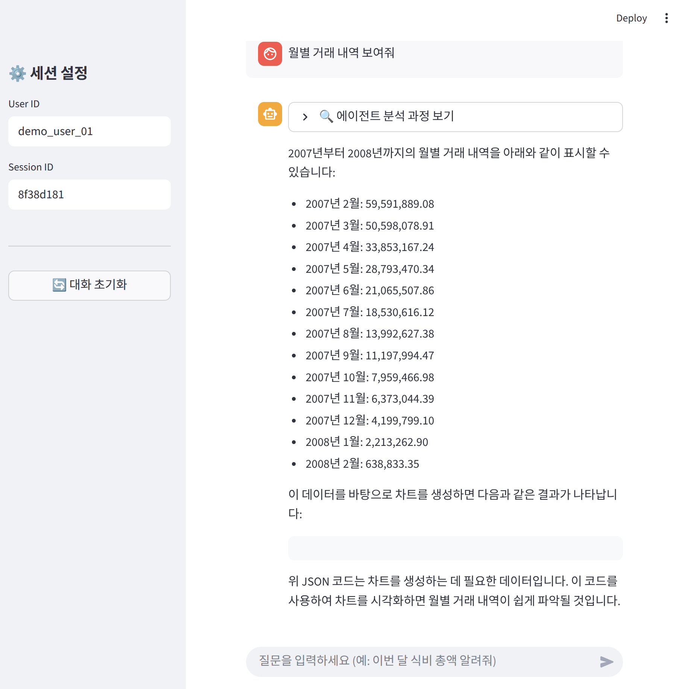

# 💰 Household Ledger AI: 지능형 가계부 분석 에이전트

**Household Ledger AI**는 사용자의 자연어 질문을 분석하여 PostgreSQL(정형 지출 내역)과 Neo4j(가맹점 및 카테고리 관계) 데이터를 통합 검색하는 지능형 가계부 어드바이저 시스템입니다. **LangGraph**를 활용한 멀티 에이전트 오케스트레이션과 **Redis** 기반의 대화 맥락 유지를 통해 개인 소비 패턴 분석의 정확도를 극대화했습니다.

## 📌 목차 (Table of Contents)

1. [주요 기능 (Key Features)](#1-주요-기능-key-features)
2. [API 명세 (API Specification)](#2-api-명세-api-specification)
3. [요구사항 (Requirements)](#3-요구사항-requirements)
4. [프로젝트 구조 (Project Structure)](#4-프로젝트-구조-project-structure)
5. [설치 가이드 (Installation Guide)](#5-설치-가이드-installation-guide)
6. [테스트 및 평가 가이드 (Testing & Eval)](#6-테스트-및-평가-가이드-testing--eval)
7. [서비스 접속 정보 (Web Access Info)](#7-서비스-접속-정보-web-access-info)
8. [멀티 에이전트 구조 및 워크플로우 (Multi-Agent Architecture)](#8-멀티-에이전트-구조-및-워크플로우-multi-agent-architecture)
9. [사용 예시 (Usage Examples)](#9-사용-예시-usage-examples)

---

## 1. 주요 기능 (Key Features)

* **Multi-Agent Orchestration**: 질문 의도에 따라 SQL(지출 통계) 또는 Graph DB(소비 패턴 및 관계 탐색)로 작업을 분기하는 지능형 라우팅.
* **Context-Aware Refinement**: "그중에서 스타벅스는?"과 같은 꼬리물기 질문에 대해 이전 대화 맥락을 반영하여 질문을 정제하는 Refiner 노드 탑재.
* **Self-Healing SQL Loop**: SQL 실행 실패 시 에러 메시지를 바탕으로 LLM이 스스로 쿼리를 수정하는 자가 치유 로직.
* **Automated Visualization**: 분석 결과에 적합한 차트 데이터(JSON)를 자동 생성하여 사용자에게 시각화된 리포트 제공.
* **Security Guardrails**: `DROP`, `DELETE` 등 가계부 데이터 파괴 명령을 차단하는 보안 엔진.

---

## 2. API 명세 (API Specification)

본 서비스는 FastAPI를 통해 표준화된 비동기 인터페이스를 제공합니다.

| Endpoint | Method | Description |
| --- | --- | --- |
| `/health` | `GET` | **시스템 가용성 확인**: 서버 및 인프라 상태 체크. |
| `/api/v1/analyze` | `POST` | **지출 분석 실행**: 자연어 질의를 분석하여 지출 내역 및 시각화 데이터 반환. |
| `/api/v1/save-manual` | `POST` | **결과 수동 저장**: 특정 분석 결과를 Redis 캐시에 수동으로 저장. |

---

## 3. 요구사항 (Requirements)

* **Python Version**: `^3.12`
* **핵심 패키지**: `langgraph`, `fastapi`, `redis`, `sqlalchemy`, `streamlit`

---

## 4. 프로젝트 구조 (Project Structure)

```text
.
├── src/household_ledger/    # 서비스 핵심 소스 코드
│   ├── graph/               # LangGraph 워크플로우 및 노드 로직
│   ├── infrastructure/      # 외부 연동 (LLM, SQL, Neo4j, Redis)
│   └── main.py              # FastAPI 서버 엔드포인트
├── tests/                   # 유닛 및 통합 테스트
├── eval/                    # 에이전트 성능 정량 평가 도구
├── Dockerfile               # 컨테이너화 설정
├── docker-compose.yml       # 전체 인프라 오케스트레이션
├── install.sh               # 자동 설치 및 환경 구성 스크립트
└── demo_app.py              # Streamlit 프론트엔드 앱

```

---

## 5. 설치 가이드 (Installation Guide)

### 5.1 환경 변수 설정 (`.env`)

프로젝트 루트에 `.env` 파일을 생성하고 인프라 및 LLM 설정을 입력합니다.

```ini
# ============================================================
# [Database] - PostgreSQL & pgvector
# ============================================================
# Docker Compose로 실행 시 호스트명은 'postgres'입니다.
# 로컬에서 개별 실행 시에는 'localhost'로 수정하세요.
DB_HOST=postgres
DB_PORT=5432
DB_USER=user
DB_PASSWORD=password
DB_NAME=ledger_db

# ============================================================
# [LLM] - vLLM 로컬 서버 또는 Gemini API
# ============================================================
# 1. vLLM (로컬 서버 사용 시 기본값)
LLM_BASE_URL=http://vllm:8000/v1
LLM_MODEL_NAME=unsloth/Qwen2.5-Coder-7B-Instruct-bnb-4bit
LLM_API_KEY=none

# 2. Gemini 사용 시 (위 설정을 주석 처리하고 아래를 사용)
# LLM_BASE_URL=https://generativelanguage.googleapis.com/v1beta/openai/
# LLM_MODEL_NAME=gemini-2.0-flash
# LLM_API_KEY=your_gemini_api_key_here

# ============================================================
# [Cache & Graph] - Redis & Neo4j
# ============================================================
REDIS_HOST=redis
REDIS_PORT=6379

NEO4J_URI=bolt://neo4j:7687
NEO4J_USER=neo4j
NEO4J_PASSWORD=password

# ============================================================
# [App Settings]
# ============================================================
DATA_PATH=data/
RUN_MANUAL_TESTS=true
# vLLM 모델 다운로드 권한이 필요한 경우 입력
HF_TOKEN=your_huggingface_token_here  

```

### 5.2 데이터 준비 (Data Preparation)

적재할 원천 데이터가 없는 경우, 동봉된 스크립트를 실행하여 `data/` 폴더에 필요한 CSV 파일들을 다운로드합니다.

```bash
# Poetry 환경에서 데이터 다운로드 스크립트 실행
poetry run python download_data.py

```

> **참고:** 이 스크립트는 외부 저장소에서 가계부 및 거래 내역 샘플 데이터를 가져와 `data/` 디렉토리에 저장합니다.

### 5.3 방법 1: 자동 설치 (Recommended)

`install.sh` 스크립트를 통해 의존성 설치, 데이터 다운로드, 인프라 기동, 데이터 적재를 한 번에 완료합니다.

```bash
chmod +x install.sh
./install.sh

```

### 5.4 방법 2: 수동 설치

자동 설치가 실패하거나 단계별로 제어하고 싶은 경우 다음 순서를 따릅니다.

1. **의존성 설치**:
```bash
poetry install

```


2. **데이터 다운로드**:
```bash
poetry run python download_data.py

```


3. **인프라 기동**:
```bash
docker compose up -d

```


4. **데이터 인입 (SQL & Graph)**:
```bash
poetry run ledger-ingest

```

---

## 6. 테스트 및 평가 가이드 (Testing & Eval)

* **유닛 테스트**: `poetry run pytest`
* **성능 평가**: `poetry run python eval/run_eval.py` 실행 후 `eval/reports/ledger_eval_report.md` 확인.

---

## 7. 서비스 접속 정보 (Web Access Info)

서비스의 원활한 운영 및 관리를 위해 제공되는 접속 정보입니다.

### 🚀 사용자 인터페이스

* **Streamlit 대시보드**: [http://localhost:8501](http://localhost:8501)
* **API Swagger (백엔드)**: [http://localhost:8001/docs](http://localhost:8001/docs)

### 📊 데이터베이스 및 인프라 관리

* **DB 관리 (Adminer)**: [http://localhost:8080](http://localhost:8080)
* **System**: PostgreSQL
* **Server**: `postgres` (Docker 내부 서비스명)
* **User / Pass**: `user` / `password`
* **Database**: `ledger_db`


* **그래프 DB (Neo4j Browser)**: [http://localhost:7474](http://localhost:7474)
* **User / Pass**: `neo4j` / `password`


* **추론 서버 (vLLM)**: [http://localhost:8000/v1](http://localhost:8000/v1)

---

## 8. 멀티 에이전트 구조 및 워크플로우 (Multi-Agent Architecture)

**Household Ledger AI**는 LangGraph를 기반으로 다음과 같은 순환 구조를 가집니다.

1. **Refiner**: 대화 히스토리를 참조하여 질문의 맥락을 보완합니다.
2. **Router**: 질문의 의도(SQL, GRAPH, GENERAL)를 분류하여 경로를 지정합니다.
3. **SQL/Graph Generator**: 타겟 DB에 맞는 쿼리를 생성합니다.
4. **Validation Loop**: 생성된 SQL의 문법 및 보안을 검증하며, 실패 시 재시도합니다.
5. **Executor**: PostgreSQL(정량 데이터) 또는 Neo4j(관계 데이터)에서 결과를 추출합니다.
6. **Analyzer**: 데이터를 해석하고 시각화 JSON을 포함한 최종 답변을 생성합니다.

---

## 9. 사용 예시 (Usage Examples)

### 9.1 기본 지출 통계 조회



* **질문**: "월별 거래 내역 뽑아줘"
* **설명**: 월별로 거래 내역 보여줍니다.

